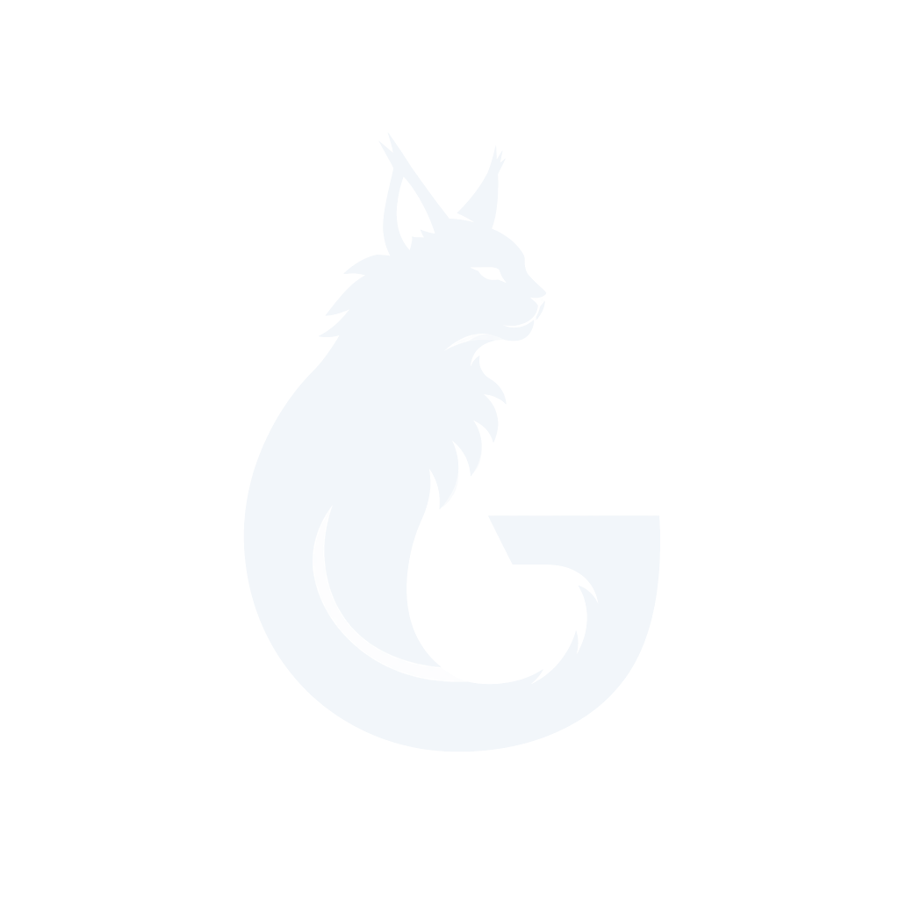

<div align="center">
  

  # Geekcom Clash

  **VPN-клиент для Steam Deck на базе Clash/Mihomo.**
  Плагин Decky Loader для подписчиков [Steam Deck Games](https://t.me/geekcom_deck_games).
</div>

---

Форк [DeckyClash](https://github.com/chenx-dust/DeckyClash) (BSD-3-Clause), допиленный под РФ/СНГ:

- 🇷🇺 **Русская локализация** и пресет DNS поверх DoH (Cloudflare / Google / Quad9) — устойчиво к DPI.
- 🔀 **Принудительный роутинг через VPN** для сервисов, которые с российского IP режутся: OpenH264, Flathub, обновления SteamOS, Decky Loader.
- 🔗 **Любая подписка** Clash / Mihomo (http(s):// или локальный файл).
- 🐾 Лёгкий: ядро Mihomo + дашборды (yacd / metacubexd / zashboard).

## Установка

> Требуется [Decky Loader](https://decky.xyz/) на Steam Deck (режим рабочего стола).

Открой терминал на Деке и выполни:

```bash
curl -L https://github.com/Nospire/geekcom-clash/raw/refs/heads/main/install.sh | bash
```

После установки плагин появится в меню Decky (быстрое меню «...»). Открой его → вкладка **Import** → вставь свою ссылку подписки → выбери её в **Subscription** → включи тумблер.

### Полезные команды

```bash
# Чистая переустановка (сбросить конфиг):
curl -L https://github.com/Nospire/geekcom-clash/raw/refs/heads/main/install.sh | bash -s -- --clean

# Полное удаление:
curl -L https://github.com/Nospire/geekcom-clash/raw/refs/heads/main/install.sh | bash -s -- --clean-uninstall
```

## Сообщество

- 📣 Канал: [Steam Deck Games](https://t.me/geekcom_deck_games)
- 📰 Новости: [Steam Deck GeekCom](https://t.me/geekcomdeck_news)
- 💬 Чат: [Geekcom-HUB](https://t.me/Geekcom_hub)
- ❤️ Поддержать: [Boosty](https://boosty.to/steamdecks)

## Сборка из исходников

```bash
pnpm install
pnpm build   # → dist/index.js
```

Бэкенд — Python (`main.py` + `py_modules/`), фронт — React/TS (`src/`) на `@decky/ui`.
Кастомизация форка собрана в [`src/branding.ts`](./src/branding.ts) и [`defaults/override.yaml`](./defaults/override.yaml).

## Благодарности

- [chenx-dust/DeckyClash](https://github.com/chenx-dust/DeckyClash) — апстрим.
- [MetaCubeX/mihomo](https://github.com/MetaCubeX/mihomo) — ядро.

Лицензия: BSD-3-Clause (см. [LICENSE](./LICENSE)).
