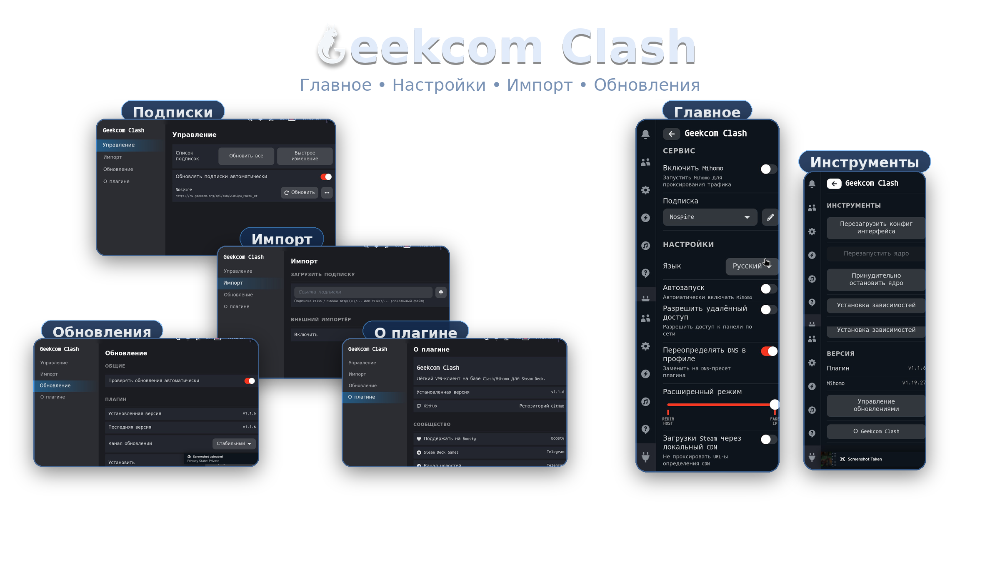
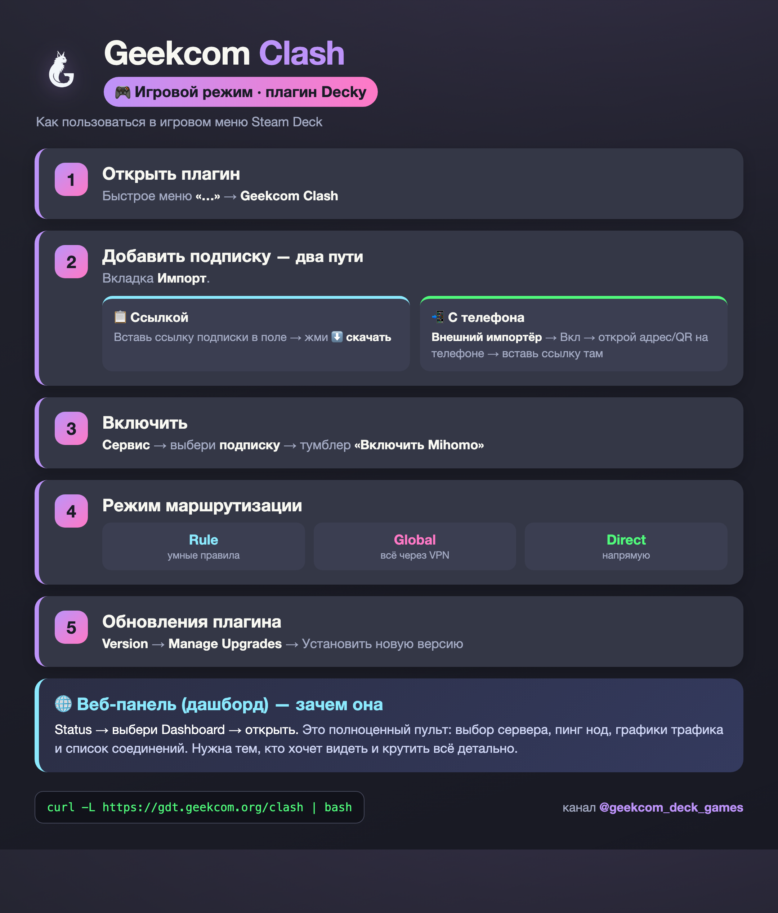
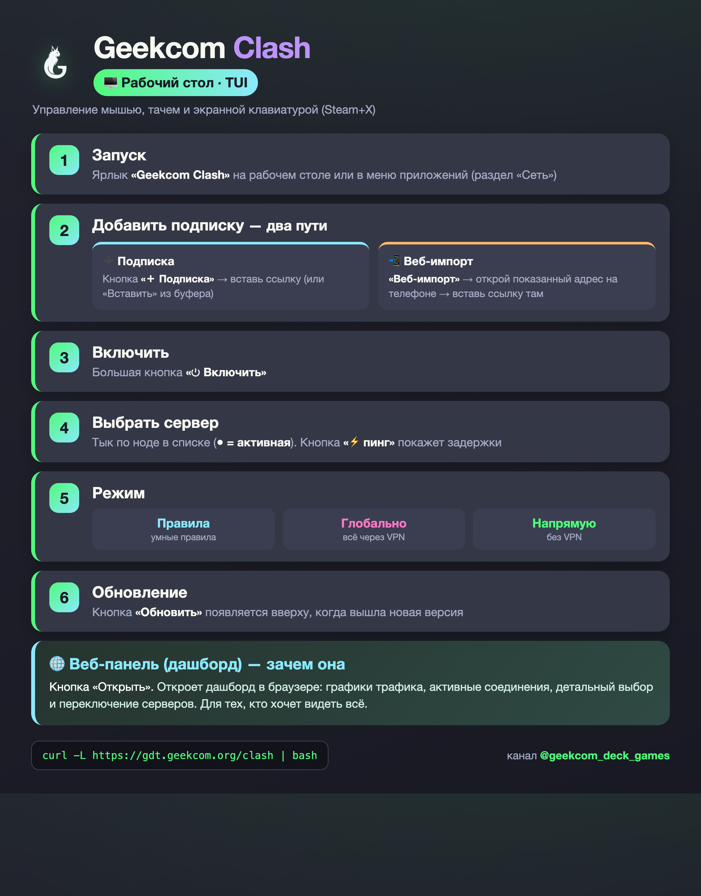
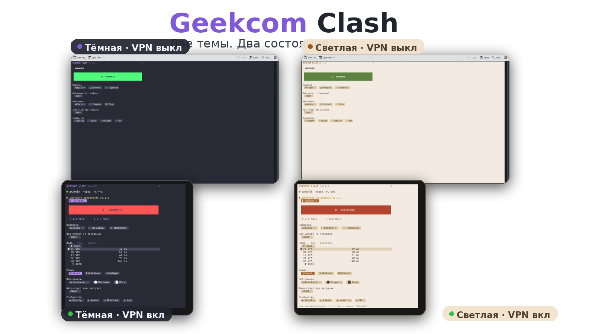

<div align="center">
  

  # Geekcom Clash

  **VPN-клиент для Steam Deck на базе Clash/Mihomo.**
  Управление в игровом режиме (плагин Decky) и на рабочем столе (свой TUI).
</div>



Лёгкий клиент Clash/Mihomo, заточенный под РФ/СНГ: полностью на русском,
системный VPN, удобное управление и в игре, и на десктопе.

## Возможности

- 🇷🇺 Полностью на русском — плагин, десктопный TUI и страница импорта
- 🌐 Системный VPN (TUN): игры, обновления SteamOS, Flathub, Decky — через туннель, даже когда их режут
- 🔀 Три режима маршрутизации: **Rule** / **Global** / **Direct**
- 📲 Импорт подписки с телефона (веб-страница по ссылке/QR)
- 🛡️ DNS поверх DoH (Cloudflare / Google / Quad9) — устойчиво к DPI
- 🖥️ Десктопный TUI: вкл/выкл, выбор сервера, тёмная/светлая темы — мышью/тачем
- ⚡ Установка и обновление одной командой

## Установка

> Требуется [Decky Loader](https://decky.xyz/). Перейди в режим рабочего стола, открой терминал:

```bash
curl -L https://gdt.geekcom.org/clash | bash
```

## Как пользоваться

### 🎮 Игровой режим (плагин Decky)



### 🖥️ Рабочий стол (TUI)





Если коротко: добавь подписку (ссылкой или с телефона) → выбери сервер → включи.
**Веб-панель** (дашборд) нужна для детальной статистики и переключения нод.

### Полезные команды

```bash
# чистая переустановка (сбросить конфиг)
curl -L https://gdt.geekcom.org/clash | bash -s -- --clean

# полное удаление
curl -L https://gdt.geekcom.org/clash | bash -s -- --clean-uninstall
```

## Сообщество

- 📣 Канал: [Steam Deck Games](https://t.me/geekcom_deck_games)
- 📰 Новости: [Steam Deck GeekCom](https://t.me/geekcomdeck_news)
- 💬 Чат: [Geekcom-HUB](https://t.me/Geekcom_hub)
- ❤️ Поддержать / подписка: [Boosty](https://boosty.to/steamdecks)

## Сборка из исходников

```bash
pnpm install
pnpm build   # → dist/index.js
```

Бэкенд — Python (`main.py` + `py_modules/`), фронт — React/TS (`src/`) на `@decky/ui`,
десктопный TUI — Go (`tui/geekcom-clash-tui/`). Кастомизация форка собрана в
[`src/branding.ts`](./src/branding.ts) и [`defaults/override.yaml`](./defaults/override.yaml).

## Происхождение и лицензия

Форк [chenx-dust/DeckyClash](https://github.com/chenx-dust/DeckyClash), допиленный под
РФ/СНГ: русская локализация, принудительный роутинг системных сервисов через VPN,
десктопный TUI, RU-DNS поверх DoH. Ядро — [MetaCubeX/mihomo](https://github.com/MetaCubeX/mihomo).

Лицензия: **BSD-3-Clause** (см. [LICENSE](./LICENSE)).
